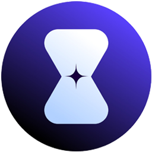
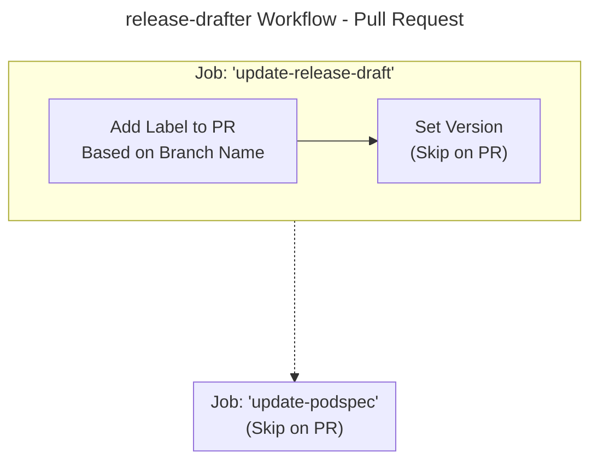
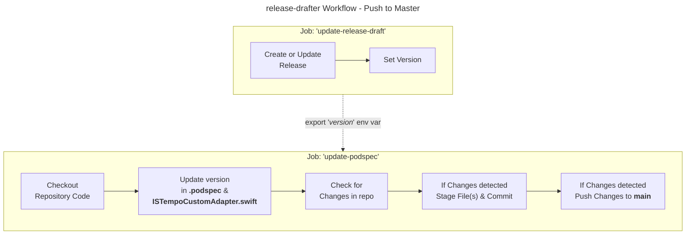
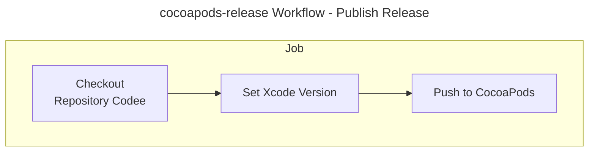

<h1 align="center">




<br/>
Tempo iOS ironSource Mediation Adapter
</h1>

Tempo iOS ironSource Mediation Adapter is a custom API that allows the Tempo SDK to talk to the ironSource SDK.

- [Publish to CocoaPods](#publish-to-cocoapods)
- [Try the Adapter](#try-the-adapter)
- [Source Control](#source-control)
    * [Branching](#branching)
    * [Pull Requests](#pull-requests)
- [CI/CD](#cicd)
    * [Release Drafter](#release-drafter)
        + [On Pull Request Open, Re-Opened or Synchronize](#on-pull-request-open-re-opened-or-synchronize)
        + [On Push to Master](#on-push-to-master)
    * [Publishing](#publishing)

## Publish to CocoaPods
1. Create a new release in GitHub with an updated version number.
2. Update the version number in "TempoSDK.podspec" file to match the above GitHub release.
3. Run `pod trunk push --allow-warnings --verbose`

## Try the Adapter

Add the following line to your Podfile:

```ruby
pod 'tempo-ios-ironsource-mediation'
```

## Source Control

### Branching

All changes to the repository must be done on a branch separate to `main`. Once work is finished on a branch it can then be merged into `main` by creating a [pull request](#pull-requests).

Branches are recommended to use the following format:

~~~
intent/title
intent-title

e.g.
feature/new-ad-type
refactor-ad-module
fix/blank-ad-issue
~~~

The start of the commit message, in this case the word feature indicates the intention of the commit. A full list of commit intentions are listed below.

The last part of the commit message is a brief description of the changes.

**Intentions**
* feature: Adding new functionality to the codebase
* enhancement: Enhancing an existing feature or making it more performant
* refactor: Removing/Restructuring code to better suit architectural constraints, developer productivity or performance
* fix: Fixing a bug
* chore: Any mind-numbing, painful or otherwise distasteful changes to the codebase
* test: Updating or adding tests
* build: Updating the build process
* docs: Updating or adding documentation
* action: Any [GitHub Actions](https://docs.github.com/en/actions) related work (pipeline yaml files, pipeline testing, etc)

### Pull Requests

> Pull requests let you tell others about changes you've pushed to a branch in a repository on GitHub. Once a pull request is opened, you can discuss and review the potential changes with collaborators and add follow-up commits before your changes are merged into the base branch.

[About Pull Requests | GitHub](https://docs.github.com/en/github/collaborating-with-issues-and-pull-requests/about-pull-requests)

Before merging our branch into development or master, we **must** create a pull request in the repository.

## CI/CD

This repository utilises [GitHub Actions workflows](https://www.notion.so/tempoplatform/GitHub-Actions-2dc5be870b4347e4a9019a9564f0c8a5?pvs=4) for both CD (Continuous Delivery/Deployment) & version management.

The workflow files can be found in `.github/workflows`.

### Release Drafter

The release-drafter.yml workflow is the mechanism by which a release number tag is generated for pod releases of the tempo-ios-sdk repo. This tag is then used when pushing pods to the CocoaPods Trunk.

This is all achieved by the release-drafter workflow running in the following scenarios:

#### On Pull Request Open, Re-Opened or Synchronize



Whenever a pull request is created, the release drafter workflow runs it's [autolabeler](https://github.com/release-drafter/release-drafter#autolabeler) functionality which adds [labels](https://docs.github.com/en/issues/using-labels-and-milestones-to-track-work/managing-labels) to the pull request based on the branch name.

Version numbers and their associated branch name patterns and labels are as follows:

| [Version Number Increment](https://semver.org/) | Branch Name                                                                                                                                                                | Generated Label                                            |
|-------------------------------------------------|----------------------------------------------------------------------------------------------------------------------------------------------------------------------------|------------------------------------------------------------|
| Major (1.X.X)                                   | N/A                                                                                                                                                                        | breaking                                                   |
| Minor (X.1.X)                                   | "feature/..."<br>"feature-..."<br>"feat/..."<br>"feat-..."<br>"enhancement/..."<br>"enhancement-..."<br>"enhance/..."<br>"enhance-..."<br>"refactor/..."<br>"refactor-..." | feature<br><br><br><br>enhancement<br><br><br><br>refactor |
| Patch (X.X.1)                                   | "fix/..."<br>"fix-..."<br>"bugfix/..."<br>"bugfix-..."<br>"chore/..."<br>"chore-..."                                                                                       | fix<br><br><br><br>chore                                   |

#### On Push to Master



When a pull request is closed and pushed to master, release drafter will either create a new release or append the currently opened draft release with the following:
* A bump to the required version
* Details around the closed pull request under specific headings
* Contributor details

### Publishing



Once you are satisfied with a release, publish it to then trigger the push to CocoaPods.
Go to Releases -> Newest draft version -> Edit -> Publish

Once a Release has been published, the `cocoapods-release` workflow will deploy the new release to CocoaPods using:

`pod trunk push <podspec-path> --allow-warnings --verbose`
